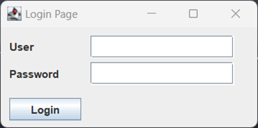
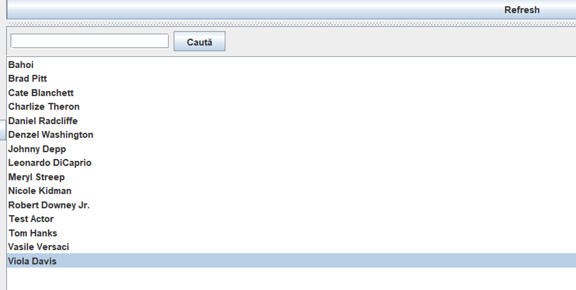

# README

## FLOW-UL APLICATIEI

Partea de login este făcută intr-o fereastra GUI unde după autentificare, utilizatorul este întrebat in care interfață vrea sa continue: GUI sau CLI.

### Interfața grafica
#### Pagina principala 

Are un sidebar unde apar anumite opțiuni in funcție de tipul de utilizator:

Regular:

Contributor:

Admin:

In centru sunt prezentate producțiile unde utilizatorul poate filtra după anumite criterii si are posibilitatea de a dublu click pe numele producției pentru a vedea detaliile si alte opțiuni referitoarea la producție.
#### Homepage-ul:

Detalii ale producției in funcție de utilizator:
-	Regular are oportunitatea de a adauga/ șterge o recenzie sau de a adauga/șterge producția in/din lista de producții favorite 
-	Staff are oportunitatea de a modifica producția daca este cel care a adăugat-o in sistem 

#### Actors Page:

Detalii ale actorului si opțiunile prezentate sunt asemănătoare cu cele de la producție.
Paginile pentru producții preferate/contribuite si actori preferați/contribuiți sunt asemănătoare si nu necesita detaliere.

Utilizatorii Staff au opțiunea de a adăuga actori sau producții si de a-si modifica ulterior contribuțiile. Pe lângă aceste opțiuni, utilizatorii Admin au posibilitatea de a vedea detalii despre utilizatori si chiar de a crea noi utilizatori sau de a șterge (username-ul si parola sunt generate automat si pot fi văzute doar de un utilizator daca vrea sa vadă detaliile unui utilizator)
Creare user:
Detalii user:
Modificare user: 

Request-urile sunt împărțite in 3 pagini:
-	Creare request – pentru Regular si Contributor 
  - Am decis sa pun utilizatorul sa aleagă tipul de request, iar mai apoi daca tipul cererii este MOVIE_ISSUE sau ACTOR_ISSUE sa aleagă dintr-un dropdown numele producției/actorului (am ținut cont sa exclud contribuțiile daca utilizatorul este de tip Contributor)
-	Vizualizare request-uri trimise – pentru Regular si Contribuitor 
  - Utilizatorul poate vedea câteva detalii despre request si are opțiunea sa retragă cererea. Am decis ca singura oportunitate pentru a ști rezultatul cererii sa fie notificările
-	Rezolvare request-uri – pentru Staff 
  - Utilizatorul poate vedea câteva detalii despre request si are 2 opțiuni: rezolvare si respingere
  
Notificarile sunt implementate prin intermediului pattern-ului Observer si sunt folosite pentru:
-	Pentru review-uri – Când un utilizator lasă un review, vor fi notificați:
  - Utilizatorul contribuitor 
  - Toți utilizatorii care au producția/actorul in lista de favorite 
  - Toți utilizatorii care au lăsat recenzie
-	Pentru request-uri:
  - Când un utilizator creează un request va fi notificat responsabilul ca are un request de rezolvat 
  - Când un utilizator retrage un request va fi notificat responsabilul ca cererea a fost retrasa 
  - Când o cerere a fost rezolvata/ respinsa va fi notificat utilizatorul care a creat cererea

Notificările pot fi văzute in pagina Contul Meu, unde pe lângă lista de notificări sunt disponibile câteva detalii despre utilizator (username, tip de cont, experiență).

Experiența este modificata prin intermediul pattern-ului Strategy atunci când:
-	Un utilizator Regular adaugă un review (doar prima data / producție/actor) : +10
-	Un utilizator care adaugă o contribuție : +30
-	Un utilizator a cărui request a fost rezolvat : +15 (ACTOR_ISSUE) sau +20 (MOVIE_ISSUE)

### Interfața in linie de comanda
Aceasta transpune toate funcționalitățile prezentate mai sus in linia de comanda.
### Biblioteci suplimentare
Am folosit biblioteca Jackson pentru parsarea mai rapida a câtorva dintre JSON-uri.
### Bonus
Pe lângă opțiunile cerute, au fost implementate ca bonus :
- Posibilitatea de a da recenzii actorilor 
- Opțiuni de filtrare : rating minim, tipul de producție, durata producției (doar Movie), anul de apariție, numărul de sezoane (doar Series), numărul de episoade (doar Series), după actor.
